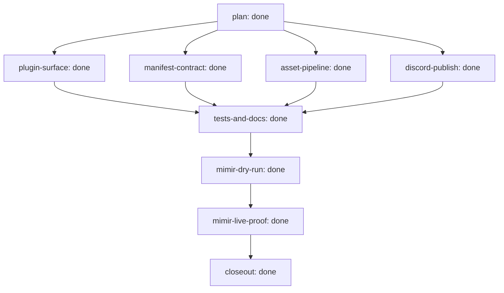

# Outcome: Implement the Discord Visual Identity Publisher requirements from docs/brainstorms/2026-07-01-discord-visual-identity-publisher-requirements.md

**Outcome ID:** `discord-visual-identity-publisher` · **Revision:** 1 · **Progress:** 9/9 (100%)

## Topology

## Attention (consolidated)

✓ no operator attention needed — every non-gated leaf is auto-advancing (R17).

## Subplots

| Subplot | State | Evidence | Cost |
| --- | --- | --- | --- |
| `plan` | done | review:docs/reviews/2026-07-01-discord-visual-identity-publisher-requirements-doc-review.md | no data yet |
| `plugin-surface` | done | — | no data yet |
| `manifest-contract` | done | — | no data yet |
| `asset-pipeline` | done | — | no data yet |
| `discord-publish` | done | — | no data yet |
| `tests-and-docs` | done | — | no data yet |
| `mimir-dry-run` | done | — | no data yet |
| `mimir-live-proof` | done | — | no data yet |
| `closeout` | done | — | no data yet |

## Cost rollup

_no data yet — the realized cost rollup (R24) is populated by U10._

## Decision trail

_—_
