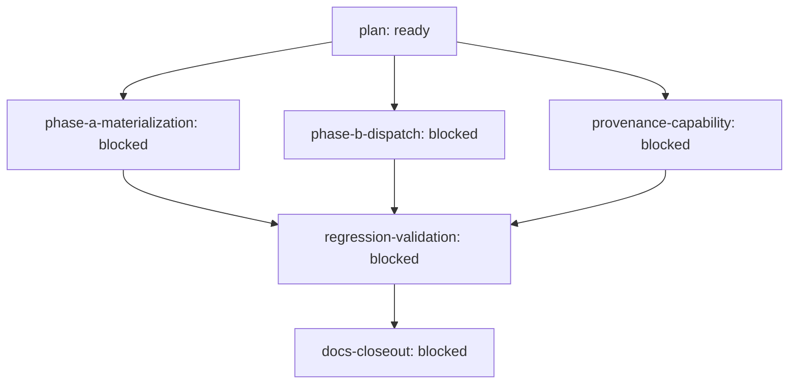

# Outcome: Implement the Team Execution and Saga orchestration repair requirements from docs/brainstorms/2026-06-30-team-execution-saga-orchestration-repair-requirements.md

**Outcome ID:** `team-execution-saga-orchestration-repair` · **Revision:** 1 · **Progress:** 0/6 (0%)

## Topology

## Attention (consolidated)

Operator attention (1 item, ranked):
1. [approval] <frontier> — frontier r1 awaiting `/outcome approve` — no leaf dispatches until approved (R20) · holds up 1 downstream

## Subplots

| Subplot | State | Evidence | Cost |
| --- | --- | --- | --- |
| `plan` | ready | review:docs/reviews/2026-06-30-team-execution-saga-orchestration-repair-requirements-doc-review.md | no data yet |
| `phase-a-materialization` | blocked | — | no data yet |
| `phase-b-dispatch` | blocked | — | no data yet |
| `provenance-capability` | blocked | — | no data yet |
| `regression-validation` | blocked | — | no data yet |
| `docs-closeout` | blocked | — | no data yet |

## Cost rollup

_no data yet — the realized cost rollup (R24) is populated by U10._

## Decision trail

_—_
