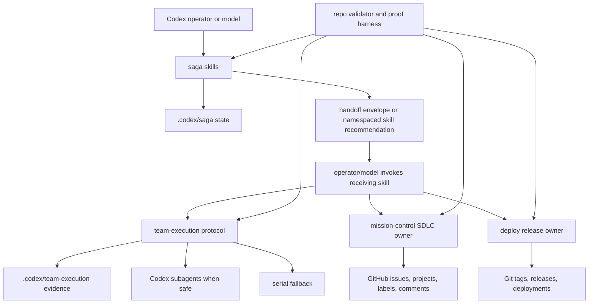
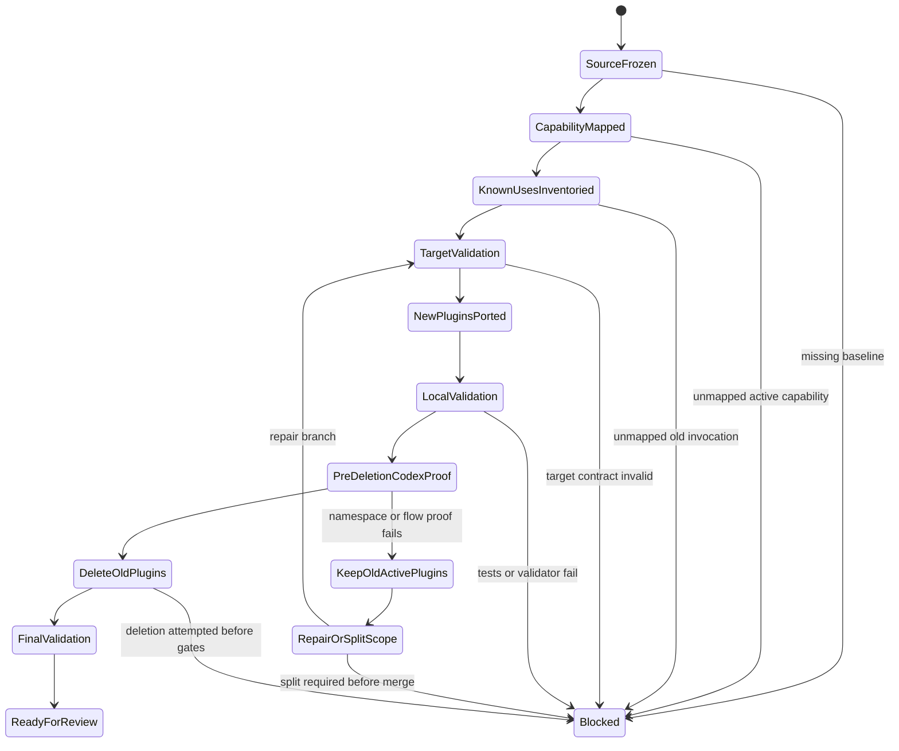
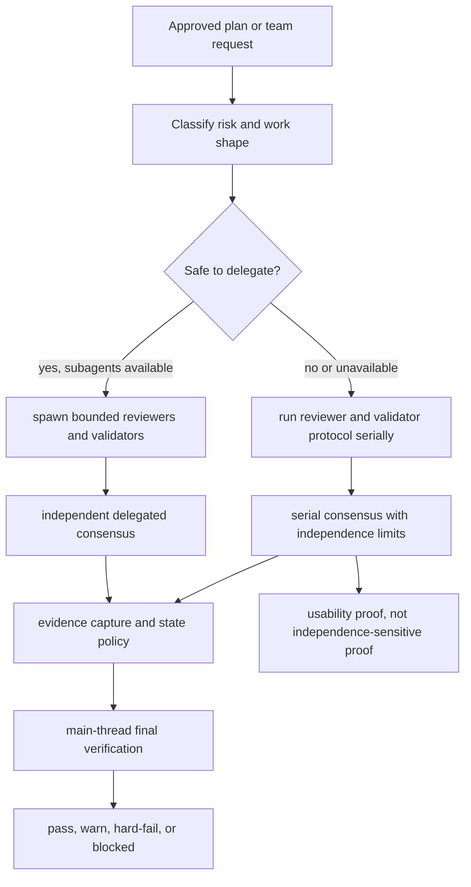
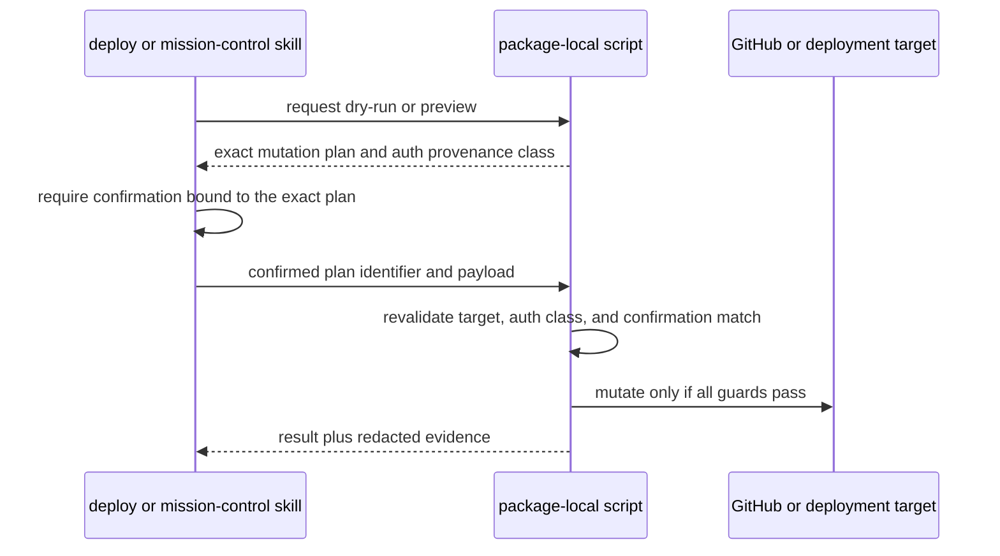

# feat: Replace Codex SDLC baseline with Saga family

## Summary

Replace the active `sdlc-manager` and `blueprint-reviewer` Codex plugins with
`saga`, `deploy`, `mission-control`, and `team-execution` in one implementation
branch. The work preserves this repo as a Codex-native adapter, ports only
Codex-usable surfaces, blocks hard deletion until parity and proof gates pass,
and proves the result in an isolated Codex profile.

---

## Problem Frame

The current repo is a curated Codex plugin adapter, not a mirror of the Claude
plugin repository. That decision remains correct, but the active plugin baseline
has drifted: `sdlc-manager` and `blueprint-reviewer` are still first-class here
while the current Infiquetra workflow has moved to Saga as lifecycle spine,
`mission-control` as SDLC successor, `deploy` as deployment owner, and
`team-execution` as reviewer and validator protocol.

This plan ports the new family as native Codex plugins. It does not treat Claude
commands, Claude manifests, or Claude agent directories as active Codex runtime
surface. It also does not execute the replacement; implementation starts only
after this plan is approved, and porting or deletion units remain blocked until
the U1 source-baseline and capability-map checkpoint is complete.

---

## Requirements

**Inventory And Cutover**

- R1. The active plugin inventory becomes exactly `saga`, `deploy`,
  `mission-control`, `team-execution`, `home-lab-ops`, `python-toolkit`,
  `unifi`, and `test-suite` (origin R1-R3, R32, AE1).
- R2. `sdlc-manager` and `blueprint-reviewer` are removed from active plugin
  source, marketplace entries, validator expectations, and baseline docs only
  after the cutover gates pass (origin R2-R5, R40, R48, AE1-AE2).
- R3. Migration and provenance docs map old active capabilities to new owners
  without keeping old skill aliases or warning shims active (origin R4-R5,
  R39-R40, R52, AE2).

**Codex-Native Packaging**

- R4. Each new plugin has `.codex-plugin/plugin.json`, `skills/`, README,
  portability notes, provenance, and validation coverage that follow this repo's
  existing plugin conventions (origin R6-R11, R33, AE9).
- R5. Active Codex plugin roots do not contain `.claude-plugin`, `commands`, or
  `agents` directories; command behavior becomes skills, references, and
  package-local scripts (origin R7-R8, R11).
- R6. Generic Saga skill names remain source-parity names behind plugin
  namespaces, and namespace failure blocks merge rather than triggering renames
  or aliases (origin R9-R10, R35-R37, R42, AE3).

**Capability Parity And Ownership**

- R7. Saga owns lifecycle choice, state, handoff envelope, and routing while
  delegating SDLC mutation to `mission-control`, deployment mutation to `deploy`,
  and review/validator orchestration to `team-execution` (origin R12-R17,
  R25, AE4).
- R8. `mission-control` fully replaces active SDLC operations from
  `sdlc-manager`, including prepared issues, boards, labels, milestones,
  metrics, rollout, comments, card validation, and preview/confirmation gates
  for GitHub writes (origin R18-R21, R43-R44, R53, AE5).
- R9. `deploy` owns tag promotion, rollback, hotfix, release notes, status, and
  deployment evidence with dry-run or preview output and explicit confirmation
  before mutation (origin R22-R25, R44, R50-R51, AE6).
- R10. `team-execution` ports the protocol, reviewer registry, validator
  registry, evidence capture, and automation safeguards using Codex subagents
  when available and a serial main-thread fallback when not (origin R26-R31,
  R38, R45-R46, R54, AE7).

**State, Security, And Proof**

- R11. Saga and team-execution runtime state uses protected `.codex/saga/` and
  `.codex/team-execution/` locations with redaction and retention expectations
  (origin R17, R31, R49, AE8).
- R12. Local validation, manifest validation, script/unit smoke checks, degraded
  mode proof, confirmation-gate proof, and isolated Codex profile proof all pass
  before the old active plugins are removed from the final inventory (origin
  R34-R38, R47-R51, AE7-AE9).
- R13. A known-use inventory maps or intentionally retires active uses of
  `sdlc-manager`, `blueprint-reviewer`, `sdlc-*`, `blueprint-review`,
  `spec-review`, and `issue-review` before hard deletion (origin R52, AE1-AE2).

---

## Key Technical Decisions

- KTD1. Single branch, gated deletion: Build the whole Saga-family replacement
  on one branch, but perform old-plugin deletion late in the branch after new
  plugin scaffolds, capability mapping, validators, and pre-deletion isolated
  Codex proof evidence exist. This honors the atomic replacement requirement
  without making the early port steps depend on a partially deleted repo. If
  proof fails after new plugin porting starts, the branch must fail closed:
  keep the old active plugins, postpone hard deletion, and either repair the
  failed replacement proof or split the failed scope into a follow-up before
  merge. A mergeable replacement branch has only one successful end state: all
  four Saga-family plugins active and both old active plugins deleted. A split
  result must be a clearly non-activation preparatory PR that does not claim to
  satisfy the atomic replacement.
- KTD2. Skill-first Codex port: Copy portable skills, references, scripts,
  config, tests, README, and changelog content; transform Claude commands into
  Codex skills or reference guidance; do not copy `.claude-plugin`, `commands`,
  or `agents` as active directories. This follows the repo's proof-port recipe
  and the Codex plugin manifest model.
- KTD3. Source-parity names stay behind namespaces: Keep Saga names such as
  `plan`, `work`, and `brainstorm` inside the `saga` plugin and prove they are
  addressable as namespaced skills by resolution or invocation evidence, not
  visibility alone. If Codex cannot address them that way, the replacement fails
  before merge.
- KTD4. Mission-control inherits and hardens the SDLC script surface:
  `mission-control` should start from the Claude `mission-control` script and
  tests, not from the older Codex `sdlc-manager` copy, then rewrite Claude state
  paths and add stricter preview/confirmation/auth boundaries for every GitHub
  write path.
- KTD5. Deploy confirmation belongs at both instruction and script boundaries:
  Skills must ask before mutation, and mutation scripts must also require an
  explicit confirmation input or flag for non-dry-run operations bound to the
  exact previewed mutation plan: host, repo, ref or tag, issue or project IDs,
  and operation payload. A user should not be able to bypass safety only because
  the script was called directly. Any real mutation proof must target an
  explicit proof-owned allowlisted repository or environment with cleanup or
  rollback evidence. Real mutation proof also requires a verified GitHub auth
  boundary for the operation: required scopes, allowed account or token-source
  classes, and prohibited broad/default credentials.
- KTD6. Team-execution agents become Codex protocol material: Claude agent
  prompts are converted into self-contained reference files or prompt templates
  consumed by the `team-execution` skill. Codex subagents are used only when the
  runtime exposes them and delegation is safe; otherwise the main thread applies
  the same reviewer, validator, evidence, dissent, and final-verification gates.
  Serial fallback evidence must be per-role and must state that consensus is
  serial rather than independently delegated.
- KTD7. `.codex` state is local, ignored, and low-sensitivity: Saga and
  team-execution may write local state under `.codex/...`, but generated files
  must be gitignored before proof runs, must not store credentials, must redact
  sensitive operational data before writing evidence, and must have explicit
  retention or cleanup rules. Tracked proof artifacts must be shareable without
  secrets, full sensitive prompts, credential-adjacent local details, or raw
  transcripts that contain protected operational data.
- KTD8. Isolated Codex proof is a release gate: Use a fresh non-default
  `CODEX_HOME` profile for marketplace registration, plugin install,
  fresh-session skill visibility, and representative skill-flow proof before
  old-plugin deletion. The proof may include a manual TUI checkpoint if Codex
  still lacks a non-interactive plugin install command, but it must produce
  machine-checkable artifacts and must not mutate the user's default profile.
- KTD9. Validation is layered, not monolithic: Keep
  `scripts/validate_codex_plugins.py` responsible for static repo shape and
  active-inventory checks, then add explicit companion checks or modes for the
  target inventory fixture, capability map, known-use inventory, proof artifact
  schema, state policy, link integrity, and runtime proof evidence. This avoids
  turning one validator into the only place where every safety rule lives.
- KTD10. Marketplace activation belongs to deletion: U2 defines and tests the
  target inventory contract in a non-default target or fixture mode, while the
  default validator continues to represent the current active repo until U8.
  `.agents/plugins/marketplace.json` activation waits until U8, when the old
  plugin roots are removed and the new roots become the final active inventory.
  Validation modes must have stable names: `current`, `target-fixture`, and
  `cutover`.
- KTD11. Saga routes by handoff, not by hidden plugin API: Saga may emit a
  handoff envelope, recommend a namespaced skill, or call package-local Saga
  helpers, but it must not depend on direct Python imports, script calls, or
  private runtime APIs inside `deploy`, `mission-control`, or `team-execution`.
  The operator/model invokes the receiving plugin skill, and that plugin owns
  its own confirmation, auth, state, and proof boundary.

---

## High-Level Technical Design

### Ownership Topology



### Orchestration Contract

Saga coordinates lifecycle state and emits handoff material. It does not import
or call private implementation surfaces from the receiving plugins. The receiving
plugin owns its own instructions, scripts, auth checks, confirmation gates, local
state, and proof evidence.

### Cutover Gate



### Team-Execution Runtime Choice



### Mutation Boundary



---

## Output Structure

The final implementation may adjust exact helper names, but the expected shape is:

```text
plugins/
  saga/
    .codex-plugin/plugin.json
    skills/<source-parity-skill>/SKILL.md
    skills/<source-parity-skill>/references/
    skills/<source-parity-skill>/scripts/
    scripts/
    tests/
    README.md
    PORTABILITY.md
    CHANGELOG.md
  deploy/
    .codex-plugin/plugin.json
    skills/deploy-state/SKILL.md
    skills/<command-derived-skill>/SKILL.md
    scripts/
    tests/
    README.md
    PORTABILITY.md
    CHANGELOG.md
  mission-control/
    .codex-plugin/plugin.json
    skills/board/SKILL.md
    skills/issues/SKILL.md
    skills/labels/SKILL.md
    skills/metrics/SKILL.md
    skills/rollout/SKILL.md
    skills/milestones/SKILL.md
    skills/flow/SKILL.md
    config/
    scripts/
    tests/
    README.md
    PORTABILITY.md
    CHANGELOG.md
  team-execution/
    .codex-plugin/plugin.json
    skills/team-execution/SKILL.md
    skills/team-execution/references/
    skills/appsec-audit/SKILL.md
    scripts/
    tests/
    README.md
    PORTABILITY.md
    CHANGELOG.md
docs/
  plans/
  portability/
    saga-family-known-use-inventory.md
  cutover/
  validation/
    saga-family-target-inventory.json
tests/
scripts/
```

---

## Implementation Units

### U1. Freeze Source Baseline And Capability Map

- **Goal:** Create the parity baseline that gates the rest of the replacement.
- **Requirements:** R2, R3, R8, R12-R13; origin R20, R40-R41, R48, R52;
  covers AE1, AE2, and AE5.
- **Dependencies:** None.
- **Files:**
  - `docs/portability/source-baseline-saga-family.md`
  - `docs/portability/saga-family-capability-map.md`
  - `docs/portability/saga-family-known-use-inventory.md`
  - `docs/portability/provenance.md`
  - `docs/engineering-journal/DECISIONS.md`
- **Approach:** Record the source snapshot from `infiquetra-claude-plugins`
  commit `16de95c82ccb2ed80d7f11018e1c2e8247a80a7f`. Inventory
  source-repo-relative roots `plugins/saga`, `plugins/deploy`,
  `plugins/mission-control`, and `plugins/team-execution`: manifests,
  commands, skills, scripts, config, tests, agents, docs, and references. Build
  an old-to-new capability map for every active `sdlc-manager` and
  `blueprint-reviewer` skill, marking each as `mission-control`,
  Saga, `team-execution`, intentionally retired, or accepted break. Reserve
  `lineage-only` for provenance and source notes, not for active old skills.
  Add a known-use inventory by searching repo-maintained docs, scripts, tests,
  marketplace config, confirmed active external invocation sources, and planned
  migration notes for active invocations of `sdlc-manager`,
  `blueprint-reviewer`, `sdlc-*`, `blueprint-review`, `spec-review`, and
  `issue-review`. Treat installed Codex cache references as provenance or
  stale-reference evidence unless they are confirmed active. Name
  `infiquetra-hermes-plugins` as a known external migration input. Each confirmed active
  hit must map to an exact replacement owner, an intentional retirement, or an
  accepted break with rationale. Cache-derived rows must store normalized
  plugin/skill identifiers and disposition only, with redacted path classes
  instead of absolute paths, local profile names, raw cache snippets, or
  transcripts. Treat this as a mandatory pre-implementation checkpoint for
  porting and deletion units: U2-U9 do not start until the source commit, remote
  provenance, source inventory, old-to-new capability map, and known-use
  inventory are recorded and reviewed.
- **Patterns to follow:** `docs/portability/provenance.md`,
  `docs/portability/matrix.md`, and `docs/engineering-journal/DECISIONS.md`.
- **Test scenarios:** Test expectation: none -- this unit creates durable
  planning and provenance docs; validator enforcement lands in U2 and U7.
- **Verification:** A reviewer can trace every removed active skill and
  confirmed active old invocation to a new owner, explicit retirement, or
  accepted break before any old plugin source is deleted.

### U2. Add Saga-Family Inventory And Validation Contract

- **Goal:** Teach repo validation about the new active plugin set, new skill
  inventories, cutover gates, and proof evidence before final deletion.
- **Requirements:** R1, R2, R4-R6, R11-R13; origin R1-R3, R6-R11, R32-R38,
  R42, R47-R54; covers AE1, AE3, AE6, AE7, AE8, and AE9.
- **Dependencies:** U1.
- **Files:**
  - `scripts/validate_codex_plugins.py`
  - `tests/test_validate_codex_plugins.py`
  - `docs/validation.md`
  - `docs/validation/saga-family-target-inventory.json`
  - `docs/portability/matrix.md`
  - `pyproject.toml`
- **Approach:** Introduce staged validation rather than flipping the default
  validator to the future inventory too early. Mode `current` keeps checking the
  current active repo until U8 and remains the default command path. Mode
  `target-fixture` validates the Saga-family target inventory and proof
  prerequisites before marketplace activation. Mode `cutover`, used after U8,
  validates the active tree
  against the new inventory. Keep checks for local marketplace source paths,
  installability, `.codex-plugin` manifests, missing skills, stale host paths,
  script-reference boundaries, and forbidden active Claude directories. Expand
  active text validation recursively across skill references, plugin READMEs,
  portability docs, and package-local references with an explicit lineage
  allowlist. Add checks that `team-execution` is no longer `blocked` in the
  portability matrix, that the source-baseline and capability-map docs exist,
  that the known-use inventory exists and has a disposition for every confirmed
  active old-use hit class, that old active plugin names are absent from final
  inventory, that host-only behaviors are rewritten or lineage-only, and that
  proof artifacts are present before cutover is considered complete. Extend
  proof-artifact checks so mutation-capable validation defaults to dry-run or
  preview, any real mutation evidence names a proof-owned allowlisted target
  with cleanup or rollback evidence, mission-control retains dry-run or preview
  modes where old workflows had them, and team-execution serial evidence records
  separate role artifacts plus serial-consensus limits. Use one test-ownership
  strategy: update `pyproject.toml` as each new plugin test suite lands, so
  default pytest discovery expands incrementally rather than relying on
  undocumented per-unit test commands.
- **Validation mode matrix:**
  - `current`: default pre-U8 mode; passes against the current active repo and
    is the CI-safe mode before marketplace activation.
  - `target-fixture`: fixture-backed mode; validates the Saga-family target
    inventory, capability map, proof prerequisites, and expected old-inventory
    failures without requiring the active marketplace to flip.
  - `cutover`: final active-tree mode; runs after U8 and fails if the old
    plugins remain active, new plugins are absent, proof artifacts are missing,
    or cutover gates are incomplete.
- **Execution note:** Target and cutover mode tests should fail against the
  current old inventory through explicit fixtures or expected-error assertions;
  default `current` validation must remain green until U8 flips the active
  inventory.
- **Patterns to follow:** Existing functions in `scripts/validate_codex_plugins.py`
  and tests in `tests/test_validate_codex_plugins.py`.
- **Test scenarios:**
  - Covers AE1. Given the old inventory, validation reports
    `sdlc-manager` and `blueprint-reviewer` as unexpected active plugins and
    the four Saga-family plugins as missing.
  - Covers AE1. Given the current pre-cutover repo, default validation still
    passes until U8 changes the active marketplace and plugin roots.
  - Covers AE1. Given the Saga-family target fixture, `target-fixture`
    validation checks the future inventory without requiring
    `.agents/plugins/marketplace.json` to be flipped before U8.
  - Covers AE1. Given a known-use inventory missing an old invocation class or
    disposition for a confirmed active use, validation blocks hard deletion.
  - Covers AE3. Given missing namespace-proof evidence for `saga:plan`,
    `saga:work`, or `saga:brainstorm`, validation blocks final cutover.
  - Covers AE6. Given deploy or mission-control proof with real mutation
    evidence outside the proof-owned allowlist or without cleanup/rollback
    evidence, validation blocks final cutover.
  - Covers AE7. Given team-execution degraded proof without per-role artifacts
    or serial-consensus labeling, validation blocks final cutover.
  - Covers AE8. Given active `.claude/saga` or `.claude/team-execution` state
    references in new plugin skill docs or skill reference files, validation
    reports stale host state unless the path is explicitly lineage-only.
  - Given active references to `AskUserQuestion` without Codex fallback,
    slash-command-only invocation, executable `cc-workflows-ultracode`, active
    `agents` or `commands` directories, or missing markdown targets, validation
    reports host-behavior or link drift.
  - Given a new plugin with a top-level `commands`, `agents`, or
    `.claude-plugin` directory, validation reports the forbidden active
    directory.
  - Given a script reference that escapes its package or points to a missing
    file, validation preserves the existing boundary failure.
  - Given each new plugin test suite lands, `pyproject.toml` includes that path
    before the unit is considered complete.
- **Verification:** Validator tests describe the new target inventory and the
  validator fails closed when proof, known-use, mutation-target, or cutover
  evidence is missing.

### U3. Port Mission-Control As SDLC Successor

- **Goal:** Add `mission-control` as the full Codex-native successor for active
  SDLC operations.
- **Requirements:** R4-R5, R8, R11-R12; origin R18-R21, R40-R44, R48-R50,
  R53; covers AE2, AE5, and AE9.
- **Dependencies:** U1, U2.
- **Files:**
  - `plugins/mission-control/.codex-plugin/plugin.json`
  - `plugins/mission-control/README.md`
  - `plugins/mission-control/PORTABILITY.md`
  - `plugins/mission-control/CHANGELOG.md`
  - `plugins/mission-control/skills/board/SKILL.md`
  - `plugins/mission-control/skills/issues/SKILL.md`
  - `plugins/mission-control/skills/labels/SKILL.md`
  - `plugins/mission-control/skills/metrics/SKILL.md`
  - `plugins/mission-control/skills/rollout/SKILL.md`
  - `plugins/mission-control/skills/milestones/SKILL.md`
  - `plugins/mission-control/skills/flow/SKILL.md`
  - `plugins/mission-control/skills/*/references/`
  - `plugins/mission-control/config/project-mappings.json`
  - `plugins/mission-control/config/sdlc-schema.json`
  - `plugins/mission-control/config/target-allowlist.json`
  - `plugins/mission-control/scripts/sdlc_manager.py`
  - `plugins/mission-control/scripts/sync_template_docs.py`
  - `plugins/mission-control/tests/`
  - `plugins/mission-control/tests/test_prompt_alignment_codex.py`
  - `pyproject.toml`
- **Approach:** Port the current Claude `mission-control` skill/script/test
  surface, then rewrite installed-path guidance to package-relative Codex
  guidance. Replace the Claude home defaults file with a Codex-local defaults
  file. Preserve prepared issue drafts and sidecars. Add or tighten
  script-level confirmation so GitHub writes present a mutation plan or dry run
  before mutation, and review any existing `--yes` style escape so it is allowed
  only when the confirmation is bound to the exact previewed host, repo, issue
  or project IDs, and operation payload, includes freshness data such as a
  digest/run id and TTL, and passes remote-state precondition checks immediately
  before mutation. Require configured GitHub host, org, repo, and project
  allowlists before any issue, board, label, milestone, comment, or project
  mutation; reject non-allowlisted targets before preview and again before
  mutation. Preserve dry-run or preview modes for every mission-control workflow
  whose `sdlc-manager` predecessor had one, and make dry-run or preview the
  default validation path. The capability map must route SDLC status and triage
  workflows to an existing mission-control skill or record them as intentionally
  removed. Rewrite source prompt-alignment tests for Codex surfaces rather than
  porting Claude assertions as-is: assert `.codex-plugin`, skills, references,
  README, and marketplace metadata instead of `.claude-plugin`, `commands`, or
  `agents`.
- **Patterns to follow:** Existing `plugins/sdlc-manager/scripts/sdlc_manager.py`
  for Codex path rewrites, existing SDLC tests under `plugins/sdlc-manager/tests`,
  and source `mission-control` tests.
- **Test scenarios:**
  - Covers AE5. Given an existing active `sdlc-manager` capability, the
    capability map points to a `mission-control` skill or records a removal
    rationale.
  - Given `issue prepare` from a local source artifact, the script writes a
    draft and sidecar without GitHub mutation.
  - Given `issue create-prepared`, the script renders a mutation plan and stops
    before mutation unless confirmation is supplied.
  - Given a confirmation token or flag produced for one mutation plan, a changed
    repo, host, issue or project ID, or payload invalidates the confirmation.
  - Given a stale or replayed confirmation token, or remote state that changed
    after preview, the script refuses mutation and requires a fresh preview.
  - Given a non-allowlisted GitHub host, org, repo, or project target, the script
    rejects the operation before preview and again before mutation.
  - Given insufficient GitHub permissions for a write path, the script returns a
    clear permission failure without logging credentials.
  - Given missing or malformed Codex defaults, mission-control warns and
    degrades instead of crashing.
  - Given board archive or label deployment in dry-run mode, the script reports
    planned actions without mutation.
  - Given a mapped old SDLC workflow that previously supported dry-run or
    preview, mission-control retains an equivalent dry-run or preview path.
  - Given SDLC status or triage workflows in the source or old capability map,
    the capability map names their owning mission-control skill or records a
    deliberate removal rationale.
  - Given Codex prompt-alignment tests, they assert the Codex plugin manifest,
    skill, reference, README, and marketplace surfaces rather than Claude
    command or agent directories.
- **Verification:** Mission-control tests pass, active skills reference packaged
  scripts correctly, and the README/auth notes explain `gh` authentication,
  required scopes, and failure behavior without storing tokens.

### U4. Port Deploy With Mutation Gates

- **Goal:** Add `deploy` as the Codex-native owner for tag-promotion deployment
  operations.
- **Requirements:** R4-R5, R7, R9, R12; origin R22-R25, R43-R44, R48,
  R50-R51; covers AE6 and AE9.
- **Dependencies:** U1, U2.
- **Files:**
  - `plugins/deploy/.codex-plugin/plugin.json`
  - `plugins/deploy/README.md`
  - `plugins/deploy/PORTABILITY.md`
  - `plugins/deploy/CHANGELOG.md`
  - `plugins/deploy/skills/deploy-state/SKILL.md`
  - `plugins/deploy/skills/deploy/SKILL.md`
  - `plugins/deploy/skills/deploy-status/SKILL.md`
  - `plugins/deploy/skills/deploy-notes/SKILL.md`
  - `plugins/deploy/skills/deploy-hotfix/SKILL.md`
  - `plugins/deploy/scripts/mint_tag.py`
  - `plugins/deploy/scripts/query_deployments.py`
  - `plugins/deploy/scripts/preview_release_notes.py`
  - `plugins/deploy/tests/test_mint_tag.py`
  - `plugins/deploy/tests/test_query_deployments.py`
  - `plugins/deploy/tests/test_preview_release_notes.py`
  - `pyproject.toml`
- **Approach:** Convert deploy commands into Codex skills while keeping
  `deploy-state` as shared policy context. Preserve repo-owner checks,
  deployment tag naming, unhealthy snapshot checks, status/drift queries, and
  release-note previews. Add explicit script-level confirmation for any
  non-dry-run tag push or release/deployment mutation, and make dry-run the
  representative validation path. Confirmation must include freshness data such
  as a digest/run id and TTL, and deploy must re-check remote-state
  preconditions immediately before mutation. If implementation needs a real
  mutation proof, point it only at an explicit proof-owned allowlisted
  repo/environment with cleanup or rollback evidence, never protected release
  state or production deployment state. Document the deploy auth model in README
  and PORTABILITY: least-privilege `gh` scopes, allowed account or token-source
  classes, prohibited broad/default credentials, no plugin-managed token
  storage, no credential logging, non-secret auth provenance fields, separation
  between validation and real-operation environments, and failure behavior for
  both `gh` API calls and git tag pushes when permissions are missing. Treat
  deploy tests as new Codex tests over the ported scripts; the pinned source has
  no deploy test suite to copy as-is.
- **Patterns to follow:** `plugins/unifi` for credentialed operation guardrails
  and existing deploy source scripts for deterministic tag logic.
- **Test scenarios:**
  - Covers AE6. Given a tag promotion without confirmation, the script prints
    preview evidence and exits without creating or pushing a tag.
  - Given `--dry-run`, the script prints the planned tag, ref, and workflow URL
    without mutation.
  - Given a non-Infiquetra remote or repo argument, the script rejects the
    operation before mutation.
  - Given an `unhealthy-v<version>` marker, forward promotion fails unless an
    audited override is explicitly supplied.
  - Given status or release-note preview commands, the scripts run in read-only
    mode and do not require mutation confirmation.
  - Given a real mutation proof fixture or harness config, it rejects production
    deployment state, protected release state, and non-allowlisted targets.
  - Given any non-dry-run tag push path, including nonprod, confirmation is
    bound to the exact host, repo, source ref, tag, and payload that were
    previewed.
  - Given a stale or replayed confirmation token, or remote state that changed
    after preview, deploy refuses mutation and requires a fresh preview.
  - Given missing `gh` auth or insufficient repository access, the failure is
    explicit and does not log secrets.
  - Given a real mutation proof with unverifiable scopes or a prohibited token
    source class, deploy falls back to dry-run-only proof and blocks mutation.
  - Given deploy write paths, tests or validator fixtures prove they require the
    declared auth boundary and do not rely on stored plugin tokens.
- **Verification:** Deploy tests cover dry-run, confirmation refusal, repo-owner
  guard, unhealthy-marker guard, every non-dry-run tag push path,
  rollback/hotfix tag naming, and read-only status or release-note paths, plus
  auth-scope guidance, auth-provenance recording, no-token-storage behavior, no
  credential logging, and validation-vs-real-operation separation.

### U5. Port Team-Execution With Subagent And Serial Modes

- **Goal:** Add `team-execution` as a Codex-native protocol that uses subagents
  when available and remains usable without them.
- **Requirements:** R4-R5, R10-R12; origin R26-R31, R38, R45-R49, R54; covers
  AE7, AE8, and AE9.
- **Dependencies:** U1, U2.
- **Files:**
  - `plugins/team-execution/.codex-plugin/plugin.json`
  - `plugins/team-execution/README.md`
  - `plugins/team-execution/PORTABILITY.md`
  - `plugins/team-execution/CHANGELOG.md`
  - `plugins/team-execution/skills/team-execution/SKILL.md`
  - `plugins/team-execution/skills/team-execution/references/reviewer-registry.md`
  - `plugins/team-execution/skills/team-execution/references/review-criteria.md`
  - `plugins/team-execution/skills/team-execution/references/consensus-protocol.md`
  - `plugins/team-execution/skills/team-execution/references/validator-registry.md`
  - `plugins/team-execution/skills/team-execution/references/validator-criteria.md`
  - `plugins/team-execution/skills/team-execution/references/validator-execution-order.md`
  - `plugins/team-execution/skills/team-execution/references/validator-evidence-state.md`
  - `plugins/team-execution/skills/team-execution/references/validator-spawn-quirks.md`
  - `plugins/team-execution/skills/team-execution/references/validator-pane-behavior.md`
  - `plugins/team-execution/skills/team-execution/references/delegation-safety.md`
  - `docs/portability/saga-family-state-policy.md`
  - `.gitignore`
  - `plugins/team-execution/skills/appsec-audit/SKILL.md`
  - `plugins/team-execution/scripts/protocol_probe.py`
  - `plugins/team-execution/tests/test_protocol_probe.py`
  - `pyproject.toml`
- **Approach:** Convert Claude agent prompts into reference registry entries or
  prompt snippets under `skills/team-execution/references/`; do not keep an
  active top-level `agents/` directory. Rewrite setup instructions away from
  Claude home guidance, tmux setup, and `.claude/team-execution`; retain any
  useful reviewer/validator concepts. Add a deterministic protocol probe that
  can simulate both subagents available and subagents absent, then verify
  bounded dispatch, backpressure handling, degraded-mode gates, state path
  policy, evidence schema, selected validator behavior, and serial fallback
  evidence that records separate reviewer and validator artifacts per role,
  labels consensus as serial or non-subagent consensus, and states independence
  limits. Treat simulated delegated-mode tests as unit characterization only;
  runtime proof must record `subagent_capability=present|absent` and use the
  real Codex subagent path when present. Add explicit prompt/material injection boundaries in
  `delegation-safety.md`: imported prompts, task artifacts, source documents,
  and delegated outputs are untrusted context; delegated prompts must delimit
  user/source material; subagents cannot authorize mutation; and delegated
  outputs require main-thread verification before they influence gates. Add
  `.codex/saga/` and
  `.codex/team-execution/` ignore rules and a state/evidence policy describing
  allowed data classes, redaction-before-write, retention, and cleanup. Port
  `validator-spawn-quirks.md` into Codex-safe protocol guidance because it
  carries required/optional validator and missing-tool behavior. Explicitly
  translate or retire `validator-pane-behavior.md` because its tmux pane model
  is Claude-host display guidance, not a Codex runtime requirement.
- **Patterns to follow:** Compound Engineering subagent guidance: use Codex
  `spawn_agent` when available, keep delegated tasks bounded, treat spawn
  failures as backpressure, and provide sequential fallback.
- **Test scenarios:**
  - Covers AE7. Given subagents unavailable, the protocol probe reports
    degraded mode and still requires reviewers, validators, evidence, dissent,
    and main-thread final verification with separate per-role artifacts and
    serial-consensus labeling.
  - Covers AE7. Given subagents available or simulated available, the probe
    proves reviewer and validator prompt construction, bounded dispatch,
    delegation-safety filtering, result ingestion, dissent capture, and
    main-thread final verification.
  - Covers AE7. Given runtime proof, the evidence records whether Codex
    subagents were present; if absent, simulated-present tests count only as
    unit coverage and release gating relies on degraded serial proof.
  - Covers AE8. Given repo-local state, the probe selects `.codex/team-execution/`
    only when it is ignored or otherwise protected; otherwise it instructs a
    user-local fallback.
  - Given a required validator with a missing tool, the protocol reports
    blocked with setup guidance instead of silently skipping.
  - Given optional validators with missing tools, the protocol records
    skipped-by-config or warn according to the registry.
  - Given source validator pane guidance, the port either translates the
    operator-relevant behavior into Codex-safe evidence guidance or records the
    tmux-specific display behavior as retired lineage.
  - Given a task containing secrets, credentials, or production-only data, the
    delegation-safety reference keeps the data main-thread and blocks subagent
    sharing.
  - Given malicious instructions in imported prompts, source artifacts, or
    delegated outputs, the protocol treats them as untrusted material and does
    not let them bypass confirmation, delegation, or final-verification gates.
  - Given reviewer non-consensus, validators do not proceed unless the operator
    explicitly overrides with rationale.
- **Verification:** Team-execution has no active agent directory, loads its
  registries from self-contained references, proves real-subagent runtime
  behavior when available, proves degraded serial behavior when unavailable,
  records serial fallback limits, and verifies local state roots are ignored
  before any proof harness writes evidence.

### U6. Port Saga Lifecycle And Codex Backend Contract

- **Goal:** Add `saga` as the Codex lifecycle spine with source-parity skill
  names, Codex state paths, and Codex-executable backend choices.
- **Requirements:** R4-R7, R10-R12; origin R9-R17, R25, R35-R37, R42, R47-R49;
  covers AE3, AE4, AE8, and AE9.
- **Dependencies:** U3, U4, U5.
- **Files:**
  - `plugins/saga/.codex-plugin/plugin.json`
  - `plugins/saga/README.md`
  - `plugins/saga/PORTABILITY.md`
  - `plugins/saga/CHANGELOG.md`
  - `plugins/saga/skills/office-hours/SKILL.md`
  - `plugins/saga/skills/ideate/SKILL.md`
  - `plugins/saga/skills/brainstorm/SKILL.md`
  - `plugins/saga/skills/spec/SKILL.md`
  - `plugins/saga/skills/strategy/SKILL.md`
  - `plugins/saga/skills/plan/SKILL.md`
  - `plugins/saga/skills/work/SKILL.md`
  - `plugins/saga/skills/qa/SKILL.md`
  - `plugins/saga/skills/investigate/SKILL.md`
  - `plugins/saga/skills/retro/SKILL.md`
  - `plugins/saga/skills/resume/SKILL.md`
  - `plugins/saga/skills/handoff/SKILL.md`
  - `plugins/saga/skills/founder-review/SKILL.md`
  - `plugins/saga/skills/ceo-review/SKILL.md`
  - `plugins/saga/skills/doc-review/SKILL.md`
  - `plugins/saga/skills/code-review/SKILL.md`
  - `plugins/saga/skills/optimize/SKILL.md`
  - `plugins/saga/skills/loop/SKILL.md`
  - `plugins/saga/references/`
  - `plugins/saga/skills/*/references/`
  - `plugins/saga/skills/*/scripts/`
  - `plugins/saga/scripts/`
  - `plugins/saga/tests/test_lifecycle_state.py`
  - `plugins/saga/tests/test_saga_state.py`
  - `plugins/saga/tests/test_handoff_envelope.py`
  - `plugins/saga/tests/test_codex_operator_choice.py`
  - `pyproject.toml`
- **Approach:** Port Saga skills and scripts, rewriting `.claude/saga` to
  `.codex/saga`, `AskUserQuestion` references to Codex's blocking question
  equivalent or chat fallback, and slash-command routing language to skill
  routing language. Keep `cc-workflows-ultracode` documented as Claude lineage
  only; Codex offers only `inline` and `team-execution`. Preserve script helpers
  for state, handoff envelopes, issue progress, deploy strategy detection,
  session discovery where applicable, and backend recommendation, but update
  enums so Codex runtime choices cannot select the Claude-only backend. Inventory
  root Saga references such as `saga-spec.md` and `operator-choice.md`; either
  keep them as package-local references with validator-covered links or duplicate
  their required content into skill-local references with a per-reference
  mapping so every skill remains self-contained. Treat Saga tests as new Codex
  characterization tests over state paths, backend choices, handoff envelopes,
  and reference links; the pinned source snapshot has no Saga test directory to
  copy as-is. Add malicious-input characterization around source docs,
  session-discovery material, and handoff content so Saga delimits imported
  material, cannot be induced to authorize mutation, cannot expose
  `cc-workflows-ultracode` as executable, and emits only recommendations that
  receiving plugins re-verify.
- **Patterns to follow:** Source `saga` lifecycle docs, this repo's package-local
  script boundary checks, and Compound Engineering's skill self-containment
  guidance.
- **Test scenarios:**
  - Covers AE3. Given Saga installed under a namespaced plugin, representative
    proof addresses `saga:plan`, `saga:work`, and `saga:brainstorm` without
    global renames.
  - Covers AE4. Given backend recommendation in Codex mode, the offered choices
    include `inline` and `team-execution` and exclude
    `cc-workflows-ultracode`.
  - Covers AE8. Given Saga writes state, helper scripts write under
    `.codex/saga/` and never `.claude/saga/`.
  - Given a handoff, Saga produces a thin envelope that names
    `mission-control` as the issue artifact owner.
  - Given malicious source docs, session-discovery material, or handoff content,
    Saga treats it as untrusted material and does not authorize mutation,
    bypass backend rules, or bypass receiving-plugin verification.
  - Given a nonprod-deploy destination, Saga records deploy intent but routes
    mutation to `deploy`.
  - Given stale source paths in skill docs, validator detects them before
    cutover.
  - Given Saga root or skill-local markdown links, validator proves every target
    resolves after the Codex port.
- **Verification:** New Saga characterization tests pass, Codex backend tests
  prove the Claude-only backend is not executable, and skill docs use
  source-parity names without stale command-only language or broken reference
  links.

### U7. Build Pre-Deletion Isolated Codex Proof

- **Goal:** Prove actual Codex usability for the new Saga-family surface before
  old active plugin source or marketplace entries are removed.
- **Requirements:** R6, R11-R12; origin R10, R35-R38, R42, R47-R51, R54; covers
  AE3, AE6, AE7, AE8, and AE9.
- **Dependencies:** U2-U6.
- **Files:**
  - `scripts/prove_codex_plugin_profile.py`
  - `tests/test_prove_codex_plugin_profile.py`
  - `docs/validation/saga-family-codex-proof.md`
  - `docs/validation/saga-family-codex-proof.schema.json`
  - `docs/cutover/cache-replacement.md`
  - `.gitignore`
  - `scripts/validate_codex_plugins.py`
- **Approach:** Add a proof harness that creates a fresh non-default
  `CODEX_HOME`, assembles a temporary proof marketplace from repo-local new
  plugin roots without changing `.agents/plugins/marketplace.json`, records the
  plugin install command or required TUI checkpoint, and captures fresh-session
  proof evidence. The machine-readable proof contract must include the isolated
  profile path or redacted path class, marketplace path, command sequence,
  install evidence, installed inventory, namespaced skill resolution or
  invocation evidence, representative flow evidence, state paths, and
  no-default-profile checks. Raw proof artifacts live under an ignored path such
  as `.codex/proofs/saga-family/<run-id>.json`; tracked proof summaries live in
  `docs/validation/saga-family-codex-proof.md` and validate against
  `docs/validation/saga-family-codex-proof.schema.json`. The tracked proof
  document summarizes the artifact and redacts sensitive local details;
  generated raw evidence stays under ignored `.codex/...` proof state.
  The proof must cover one representative flow per new plugin: Saga namespace
  and backend proof, deploy dry-run and write-intent confirmation proof,
  mission-control prepared/dry-run and write-intent confirmation proof, and
  team-execution runtime capability plus degraded-mode proof. The harness should
  separate read-only validation from real operation, default mutation-capable
  validation to dry-run or preview, require explicit proof-owned allowlisted
  targets plus cleanup or rollback evidence for any real mutation proof, record
  non-secret auth provenance, fail real mutation proof when required scopes or
  token-source class cannot be verified, and never touch the default profile.
  U7 proves both a fresh replacement marketplace and an upgrade profile seeded
  with the old six-plugin inventory; U9 proves the final active marketplace
  after U8 deletion.
- **Patterns to follow:** Plugin-creator update and install guidance, existing
  `docs/validation.md`, and Compound Engineering's Codex install notes for
  non-default profiles.
- **Test scenarios:**
  - Covers AE3. Given a proof run without `saga:plan`, `saga:work`, and
    `saga:brainstorm` resolution or invocation evidence, the proof fails.
  - Covers AE3. Given a global `plan` or `work` skill, or another plugin with
    generic skill names, namespace proof fails unless the resolved skill belongs
    to `saga` and loads the expected Saga skill/reference content.
  - Covers AE7. Given subagents available or simulated available, the proof
    records bounded dispatch, result ingestion, dissent capture, and
    main-thread final verification.
  - Covers AE7. Given Codex subagents are present, runtime proof uses the real
    subagent path; given they are absent, simulated-present tests count only as
    unit coverage and release gating relies on degraded serial proof.
  - Covers AE7. Given subagents disabled or unavailable, the proof runs
    team-execution degraded mode and records per-role serial gate evidence,
    serial-consensus labeling, and independence limits.
  - Covers AE8. Given generated Saga or team-execution state, the proof records
    `.codex/...` paths, verifies they are ignored or protected, and checks that
    retained evidence is redacted according to the state policy.
  - Covers AE9. Given all four new plugins installed in the isolated profile,
    each representative skill flow loads at least one reference and reaches a
    bundled script or dry-run path when applicable.
  - Given deploy or mission-control write intent invoked through a Codex skill,
    the transcript shows the operator-visible mutation plan, confirmation
    refusal or prompt, and proof that no external mutation occurred.
  - Given any proof fixture that attempts a real mutation outside the
    proof-owned allowlist, without cleanup or rollback evidence, or against
    protected release or production deployment state, the proof harness rejects
    it before invoking deploy or mission-control.
  - Given a write-capable proof path, the artifact records non-secret auth
    provenance: host, account class, repo owner boundary, and token source class
    without logging credentials.
  - Given retained proof evidence, tracked artifacts contain only allowed
    summary fields and redacted excerpts, not credentials, full sensitive
    prompts, raw transcripts with protected operational data, or
    credential-adjacent local details.
  - Given the temporary proof marketplace, removed skills such as `sdlc-board`,
    `sdlc-flow`, `sdlc-issues`, `blueprint-review`, `issue-review`, and
    `spec-review` are not visible or invocable in the fresh session.
  - Given no non-interactive Codex plugin install command, the proof records a
    required manual TUI checkpoint and fails until the checkpoint is completed
    in the isolated profile.
  - Given an isolated profile seeded with the old six-plugin inventory, the
    upgrade proof applies the replacement marketplace or reinstall procedure,
    detects stale cache state, and proves old skills are absent while
    Saga-family skills are present.
  - Given an attempt to use the default profile or a reused non-empty profile,
    the proof harness refuses to run unless the profile is proven clean.
- **Verification:** The proof document and machine-readable artifact contain the
  isolated profile class, marketplace source, installed plugin list, namespaced
  Saga resolution or invocation proof, representative flow evidence for all four
  new plugins, subagent capability status, real-subagent evidence when
  available, degraded-mode evidence, skill-layer mutation-gate evidence,
  proof-owned target and cleanup evidence for real mutation proof when present,
  auth-boundary and auth-provenance evidence, old-skill absence evidence for
  fresh and upgrade proof profiles, protected state evidence, and no default
  profile mutation.

### U8. Delete Old Active Plugins And Update Active Docs

- **Goal:** Complete the active inventory switch only after the pre-deletion
  proof and local gates pass.
- **Requirements:** R1-R3, R12-R13; origin R1-R5, R32, R39-R40, R48, R52;
  covers AE1 and AE2.
- **Dependencies:** U1-U7.
- **Files:**
  - `plugins/sdlc-manager/`
  - `plugins/blueprint-reviewer/`
  - `.agents/plugins/marketplace.json`
  - `README.md`
  - `docs/baseline/codex-visible-plugins.md`
  - `docs/cutover/cache-replacement.md`
  - `docs/cutover/saga-family-rollback-and-split.md`
  - `docs/validation.md`
  - `docs/portability/matrix.md`
  - `docs/portability/provenance.md`
  - `docs/portability/saga-family-known-use-inventory.md`
  - `docs/engineering-journal/ARCHIVE.md`
  - `docs/engineering-journal/QUEUED.md`
  - `pyproject.toml`
- **Approach:** Remove old plugin source directories and old marketplace
  entries in the same change that makes new plugin entries active. Update README
  and baseline docs to describe the eight-plugin target inventory. Replace the
  old six-plugin MVP cutover gate with the Saga-family gate. Add a reachable
  migration map from old active invocations to new plugin namespaces, while
  keeping old skill aliases inactive. Each migration row must include the old
  invocation, exact replacement namespaced skill or representative Codex prompt,
  capability owner, one-line behavior difference, and removal rationale when no
  replacement exists. Reconcile that migration map with the known-use inventory
  from U1 before deletion. Add validation that every deleted skill and every
  confirmed active old invocation has a migration, retirement, or accepted-break
  row reachable from README or cutover docs. Add rollback instructions and
  split/postpone criteria in a dedicated cutover artifact. That artifact must
  state that partial replacement activation is not a successful merge state:
  either the branch completes the full Saga-family cutover, or any split branch
  remains non-activating preparatory work.
- **Patterns to follow:** Existing README inventory table and cutover gate style.
- **Test scenarios:**
  - Covers AE1. Given final inventory validation, old plugin directories and
    marketplace entries are absent and new Saga-family directories and entries
    are present.
  - Covers AE2. Given README or cutover docs, old invocations such as
    `sdlc-board`, `sdlc-flow`, `sdlc-issues`, `blueprint-review`,
    `issue-review`, and `spec-review` map to exact new namespaced skills or
    prompts without active aliases.
  - Given any deleted skill without a migration row, validation fails.
  - Given any confirmed active old invocation without a migration, retirement,
    or accepted-break row, validation fails.
  - Given old review invocations such as `blueprint-review`, `spec-review`, and
    `issue-review`, migration rows name the exact operator-facing Saga skill,
    team-execution protocol owner, or removal rationale.
  - Given rollback or split criteria are missing from cutover docs, validation
    blocks hard deletion.
  - Given provenance docs, removed plugins appear only as lineage or migration
    context and not as active usage instructions.
  - Given `pyproject.toml`, test discovery no longer points at removed plugin
    test directories.
  - Given `.agents/plugins/marketplace.json`, there are no dangling entries that
    point to deleted plugin roots or missing new plugin roots.
- **Verification:** Repo docs no longer contradict the target inventory,
  migration docs give exact next actions, and validation fails if either removed
  plugin remains active or any new marketplace entry is missing.

### U9. Run Final Review, Validation, And Cutover Audit

- **Goal:** Confirm the replacement is review-ready and safe to merge.
- **Requirements:** R1-R13; all origin acceptance examples.
- **Dependencies:** U1-U8.
- **Files:**
  - `scripts/validate_codex_plugins.py`
  - `tests/test_validate_codex_plugins.py`
  - `docs/validation.md`
  - `docs/validation/saga-family-codex-proof.md`
  - `docs/validation/saga-family-codex-proof.schema.json`
  - `docs/cutover/cache-replacement.md`
  - `docs/cutover/saga-family-rollback-and-split.md`
  - `docs/portability/saga-family-capability-map.md`
  - `docs/portability/saga-family-known-use-inventory.md`
  - `docs/portability/saga-family-state-policy.md`
  - `.gitignore`
- **Approach:** Run the narrow script/unit checks, the manifest validation loop,
  the full repo validator, and the final active-inventory isolated Codex proof.
  Parse the machine-readable proof artifact rather than trusting prose-only
  evidence. Audit the final tree for old active plugin names, forbidden Claude
  directories, stale `.claude` state paths in skills or references, missing
  migration entries, missing known-use dispositions, missing confirmation gates,
  missing mutation-target safeguards, missing auth-provenance evidence, missing
  proof evidence, broken package-local links, missing state ignore rules,
  prompt/material injection gaps, evidence-retention gaps, missing rollback or
  split criteria, missing raw-proof ignore rules, and docs that still say the
  six-plugin MVP is current.
- **Patterns to follow:** `docs/validation.md` and the existing repo validator
  output style.
- **Test scenarios:**
  - Covers AE1-AE9. Given the final branch, every acceptance example has either
    validator evidence, unit/script test evidence, or isolated Codex proof
    evidence.
  - Given any old active plugin source or marketplace entry, final validation
    fails.
  - Given final Codex visibility output where removed skills such as
    `sdlc-board`, `sdlc-flow`, `sdlc-issues`, `blueprint-review`,
    `issue-review`, or `spec-review` remain visible or invocable, final
    validation fails.
  - Given migration docs collapse old review invocations into a vague
    `saga/team-execution` owner instead of exact operator skill, protocol owner,
    or removal rationale, final validation fails.
  - Given a proof document without a parseable companion artifact or required
    evidence fields, final validation fails.
  - Given missing deploy or mission-control confirmation-gate tests, final
    validation fails or the cutover checklist blocks deletion.
  - Given deploy or mission-control validation that mutates protected release or
    production deployment state, final validation fails.
  - Given deploy or mission-control confirmation that is not bound to the exact
    previewed mutation plan, final validation fails.
  - Given write-capable proof without non-secret auth provenance, final
    validation fails.
  - Given missing deploy or mission-control auth-boundary documentation and
    tests, final validation fails or the cutover checklist blocks deletion.
  - Given missing known-use inventory dispositions for confirmed active old
    plugin or skill invocations, final validation fails.
  - Given team-execution degraded evidence without separate role artifacts,
    serial-consensus labeling, or independence limits, final validation fails.
  - Given stale `.claude-plugin`, `commands`, or `agents` directories inside
    active plugin roots, final validation fails.
  - Given active references to host-only Claude behavior, unresolved markdown
    links, or untrusted prompt material that can bypass gates, final validation
    fails.
  - Given tracked proof artifacts that retain forbidden data classes, raw
    sensitive transcripts, credentials, or credential-adjacent local details,
    final validation fails.
  - Given missing `.codex/saga/` or `.codex/team-execution/` ignore coverage,
    state policy, redaction checks, or retention/cleanup expectations, final
    validation fails.
  - Given proof evidence from the default Codex profile, final validation fails.
  - Given missing rollback/split criteria or missing stale-cache upgrade proof,
    final validation fails.
- **Verification:** The branch is ready for code review only when repo
  validation, manifest validation, script/unit tests, real-subagent proof when
  capability is present, degraded-mode proof, serial fallback artifact proof,
  skill-layer mutation-gate proof, proof-owned target and cleanup proof where
  real mutation is present, old-skill absence proof, known-use inventory proof,
  auth-provenance proof, retention policy proof, and final isolated Codex proof
  all pass.

---

## Scope Boundaries

### Deferred To Follow-Up Work

- Custom-agent sidecar installer or `.codex/agents/` generator.
- A converter CLI that automatically transforms arbitrary Claude plugins into
  Codex plugins.
- Publishing beyond repo-local or isolated-profile validation.
- Reintroducing old invocation aliases or warning-shim skills.

### Outside This Replacement

- Keeping `sdlc-manager` or `blueprint-reviewer` active.
- Treating Claude command files or agent files as active Codex plugin runtime
  surfaces.
- Offering `cc-workflows-ultracode` as an executable Codex backend.
- Mutating the user's default Codex profile during validation.
- Letting Saga directly mutate deployment or SDLC state.

---

## System-Wide Impact

This change alters the active Codex plugin contract, the local marketplace
inventory, the repo validator, pytest discovery, and the documented cutover
baseline. It also introduces two local runtime state roots, `.codex/saga/` and
`.codex/team-execution/`, that must be protected from accidental commits and
credential leakage.

The highest-risk operational surfaces are GitHub write paths in
`mission-control` and tag or release mutation in `deploy`. Both must remain
readable and dry-runnable without mutation, and both need explicit permission
failure behavior because Codex plugin access does not override GitHub
permissions.

The hard-delete decision also makes usage discovery a system-wide concern. The
replacement should fail closed if old plugin or skill invocations are still
known but not mapped, retired, or recorded as accepted breaks.

All ported source material is untrusted context until rewritten and validated
for Codex. Claude-origin skills, commands, agent prompts, migration maps, and
proof transcripts cannot override Codex safety rules, mutation confirmation,
auth boundaries, or main-thread final verification.

---

## Risks And Mitigations

- **Codex namespace proof may fail.** Mitigation: treat this as a merge blocker
  per KTD3; do not add aliases or rename generic Saga skills as a workaround.
- **Codex plugin install may require TUI interaction.** Mitigation: isolate the
  profile, make the proof harness record the manual checkpoint, and fail until
  proof evidence exists.
- **Mission-control or deploy could mutate external state during tests.**
  Mitigation: default representative tests to dry-run, fixtures, or mocked
  subprocess calls; require exact-plan confirmation for non-dry-run writes;
  reject non-allowlisted, protected release, or production deployment targets in
  proof harnesses.
- **A broad confirmation could be reused for the wrong mutation.** Mitigation:
  bind confirmations to the previewed host, repo, ref or tag, issue or project
  IDs, and operation payload; scripts revalidate the match before mutation.
- **Proof could pass under an overbroad personal credential.** Mitigation:
  record non-secret auth provenance, including host, account class, repo owner
  boundary, and token source class, without logging credentials.
- **Team-execution could become a no-op without Claude agents.** Mitigation:
  make degraded mode a tested protocol with required reviewer, validator,
  evidence, dissent, serial-consensus labeling, and final-verification gates.
- **Ported prompts or transcripts could inject unsafe instructions.**
  Mitigation: treat source prompts, migration docs, proof transcripts, and
  delegated outputs as untrusted material that cannot bypass confirmation,
  delegation, auth, or verification gates.
- **Tracked proof artifacts could leak sensitive material.** Mitigation: define
  allowed evidence fields, forbidden data classes, raw transcript handling,
  retention horizon, cleanup trigger, and shareability checks before proof
  artifacts are committed.
- **Old active docs could survive the deletion.** Mitigation: extend validation
  to reject stale active inventory and stale host/path references, then run a
  final audit in U9.
- **Known old invocations could break silently after hard deletion.**
  Mitigation: build a known-use inventory before deletion and require a
  migration, retirement, or accepted-break disposition for each hit.
- **Source parity could become unreviewable because the port is large.**
  Mitigation: freeze a capability map first, keep plugin boundaries separate,
  and make each implementation unit trace to specific source surfaces and tests.

---

## Documentation And Operational Notes

- README must show the new eight-plugin inventory and make the Saga-family
  replacement visible from the normal usage path.
- Cutover docs must replace "six MVP plugins" with the Saga-family gate and
  include the migration map and known-use disposition summary.
- Validation docs must distinguish repo validation, manifest validation, script
  smoke checks, isolated Codex proof, dry-run proof, proof-owned mutation proof,
  staged target/cutover validation, and real GitHub/deployment operations.
- Portability docs must preserve lineage without implying Claude-only files are
  active Codex runtime.
- The proof document must identify the isolated-profile class, not rely on chat
  memory as evidence, and link to a generated machine-readable artifact whose
  schema is validator-covered.
- Proof and state-policy docs must define allowed evidence fields, forbidden
  data classes, raw transcript handling, retention horizon, cleanup trigger, and
  non-secret auth provenance fields.

---

## Deferred Implementation Notes

- Exact helper names may change during implementation, but helper placement must
  stay package-local and validator-covered.
- Some Saga skill references may need duplication across skill directories to
  remain self-contained; prefer duplication over cross-skill relative paths, and
  record any root-reference reuse in the Saga reference map.
- If Codex introduces a non-interactive plugin install command before
  implementation finishes, use it in the isolated proof harness and remove the
  manual TUI checkpoint.
- If a mission-control capability is no longer part of active Infiquetra SDLC
  operations, record the removal in the capability map instead of silently
  dropping it.

---

## Sources And Research

- Origin requirements: `docs/brainstorms/2026-06-06-codex-saga-family-replacement-requirements.md`
- Prior ideation: `docs/ideation/2026-06-06-codex-saga-port-ideation.md`
- Existing repo contracts: `README.md`, `scripts/validate_codex_plugins.py`,
  `tests/test_validate_codex_plugins.py`, `docs/validation.md`,
  `docs/cutover/cache-replacement.md`, `docs/portability/matrix.md`,
  `docs/portability/provenance.md`, `docs/baseline/codex-visible-plugins.md`
- Existing active plugin patterns: `plugins/sdlc-manager`, `plugins/unifi`,
  `plugins/test-suite`
- Source baseline: `infiquetra-claude-plugins` at
  `16de95c82ccb2ed80d7f11018e1c2e8247a80a7f`, source-repo-relative roots
  `plugins/saga`, `plugins/deploy`, `plugins/mission-control`, and
  `plugins/team-execution`
- Planning inventory observed for that source snapshot:
  - `saga`: lifecycle skills, lifecycle state/handoff scripts, command-origin
    routing, and backend-choice material that must become Codex skill routing
    with only `inline` and `team-execution` executable.
  - `deploy`: deploy, status, release-note, hotfix, and deploy-state surfaces
    with tag, release, deployment, status, and rollback/hotfix evidence paths.
  - `mission-control`: issue, board, metrics, triage, labels, milestones,
    rollout, flow, and validation surfaces that replace active SDLC ownership.
  - `team-execution`: reviewer and validator protocol material, prompt
    registry inputs, evidence-state references, and Claude agent prompts that
    become Codex references or prompt snippets rather than active agents.
- Codex plugin creation guidance: local `plugin-creator` skill, including
  `.codex-plugin/plugin.json`, repo-local marketplace entry shape, manifest
  validation, and cachebuster/reinstall flow.
- OpenAI: Plugins package skills and optional app-backed capabilities; skills
  are reusable workflow instructions invoked from Codex.
  https://openai.com/academy/codex-plugins-and-skills/
- OpenAI: Plugin access does not override source-system permissions, and action
  controls or confirmations matter for write-capable workflows.
  https://help.openai.com/de-de/articles/20001256-plugins-in-codex
- EveryInc Compound Engineering README: Codex native plugin install handles
  skills, while custom agents still need a separate install path in that
  project; this supports a skill-first v1 without a custom-agent sidecar.
  https://github.com/everyinc/compound-engineering-plugin
- EveryInc Compound Engineering AGENTS.md: skills should be self-contained, use
  relative references, and name platform-specific subagent equivalents with
  sequential fallback.
  https://github.com/EveryInc/compound-engineering-plugin/blob/main/AGENTS.md
