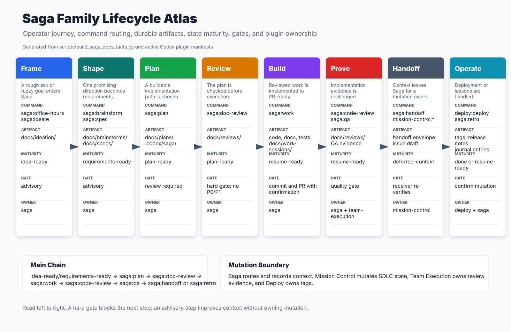

# Quick Reference

Keep this page open when choosing a Saga family command.

## Which Command?

| Situation | Command |
|---|---|
| "I have an idea but not the frame" | `saga:office-hours` |
| "Give me options" | `saga:ideate` |
| "Which idea is worth testing cheaply?" | `saga:product-review` |
| "Deepen this one idea into requirements" | `saga:brainstorm` |
| "Make this vague ask precise" | `saga:spec` |
| "Author a context-library implementation spec" | `saga:implementation-spec` |
| "How should we build it?" | `saga:plan` |
| "Is this plan ready?" | `saga:doc-review` |
| "Build the reviewed plan" | `saga:work` |
| "Review the implementation" | `saga:code-review` |
| "Does it actually work?" | `saga:qa` |
| "Create an SDLC issue draft" | `saga:handoff` then `mission-control:issues` |
| "Escalate to reviewers/validators" | `verified-workflows:run` |
| "Promote or inspect a release" | `deploy:deploy`, `deploy:deploy-status`, or `deploy:deploy-notes` |

## Maturity Routing

| Maturity | Next normal move |
|---|---|
| `idea-ready` | `saga:brainstorm` or `saga:plan` |
| `experiment-ready` | `saga:plan` for a scoped prototype or spike |
| `requirements-ready` | `saga:plan` |
| `plan-ready` | `saga:work` |
| `resume-ready` | `saga:work`, `saga:code-review`, `saga:qa`, or `saga:retro` |
| `deferred-context` | inspect source context, then route deliberately |

## Hard Boundaries

| Boundary | Rule |
|---|---|
| Plan execution | Run `saga:doc-review` before `saga:work`; unresolved P0/P1 blocks execution. |
| GitHub mutation | Use `mission-control`; Saga handoff context is not authority. |
| Deployment mutation | Use `deploy`; Saga only records deployment intent. |
| Reviewer protocol | Use `verified-workflows`; reviewers collect evidence but do not authorize mutation. |
| Local Saga cache | `.codex/saga/` helps resume but loses to git, GitHub, deployment state, and journal records. |

## Visuals

The presentation assets live in [visual-assets](visual-assets/).

