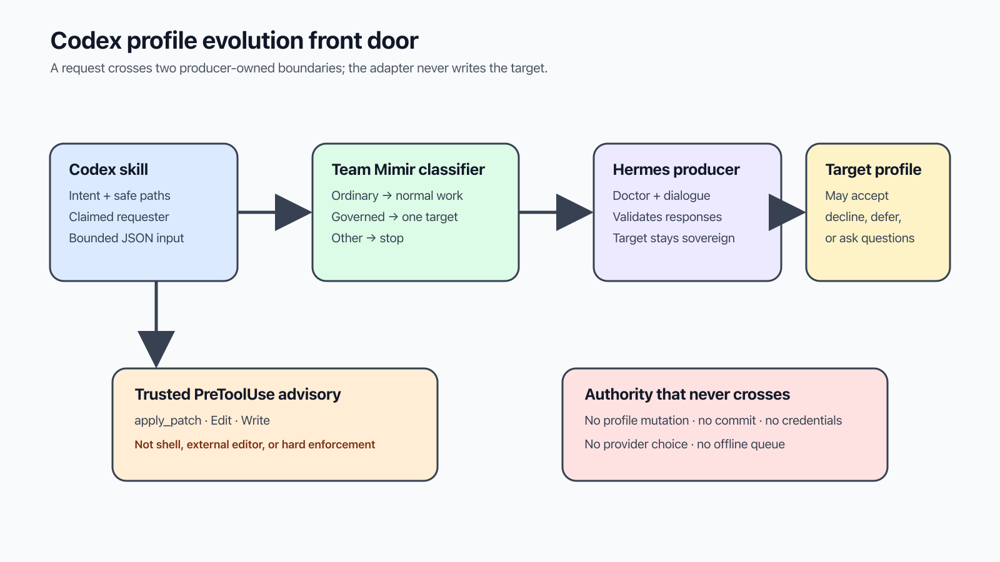

# Use Hermes Profile Evolution in Codex

This plugin is the Codex front door for proposing a change to one Team Mimir
profile. It classifies the affected paths, opens target-owned Hermes dialogue,
and never edits or commits the target profile itself.



## Install and verify

Add or refresh the Infiquetra marketplace, install the plugin, and check the
installed version:

```bash
codex plugin marketplace add infiquetra/infiquetra-codex-plugins --ref main --json
codex plugin add hermes-profile-evolution@infiquetra-codex-plugins --json
codex plugin list --marketplace infiquetra-codex-plugins --json
```

The manifest version is `0.1.0`. If the marketplace already exists, use
`codex plugin marketplace upgrade infiquetra-codex-plugins` before the install.
Start a fresh Codex session after installation so skill and hook discovery use
the installed bytes.

In the installed skill, commands are run from the skill directory. Define the
adapter once for the examples below:

```bash
PROFILE_ADAPTER=../../scripts/profile_request.py
```

## Start a request

The target is the named profile that owns the proposed behavior. The Codex
harness is recorded as a claimed requester and delegation hop; it is not the
target and cannot claim the target's identity.

```bash
printf '%s' '{"schema_version":1,"intent":"Consider clarifying your review preference.","paths":["profiles/brokkr/SOUL.md"],"evidence_references":["docs/team/README.md"]}' \
  | python3 "$PROFILE_ADAPTER" suggest brokkr
```

Ordinary repository paths return `ordinary_repository_edit` without contacting
Hermes. Governed paths must classify to exactly the named target. Save the
returned proposal envelope for the remaining commands.

## Continue or inspect dialogue

Use the exact proposal envelope returned by the first request:

```bash
printf '%s' '{"schema_version":1,"proposal":<proposal-envelope>,"message":"Please explain the tradeoff."}' \
  | python3 "$PROFILE_ADAPTER" reply

printf '%s' '{"schema_version":1,"proposal":<proposal-envelope>}' \
  | python3 "$PROFILE_ADAPTER" resume

python3 "$PROFILE_ADAPTER" status \
  --proposal-id proposal-0123456789abcdef \
  --revision <64-character-revision-digest> \
  --target brokkr

python3 "$PROFILE_ADAPTER" doctor brokkr
```

`reply` sends one message. `resume` continues without adding a message.
`status` reads one proposal revision. `doctor` verifies the canonical producer
route, credentials, service, and target response without changing a profile.

## Advisory boundary and failures

The trusted `PreToolUse` hook inspects supported `apply_patch`, `Edit`, and
`Write` calls. Its deny response is guidance, and the hook process exits zero
because Codex hooks are not an operating-system security boundary. Shell tools,
external editors, disabled hooks, and same-user access remain outside it.

The adapter exits `0` after a validated response and `2` for invalid input,
classification failure, unavailable or incompatible Hermes service, contract
drift, target mismatch, or malformed producer output. Stop on exit `2`; do not
work around it with a direct profile edit.

## Privacy

Send repository-relative paths, a short intent, and sanitized repository
references only. Do not send credentials, tokens, host addresses, private
runtime paths, logs, transcripts, databases, system prompts, tools, providers,
or models. Input is bounded JSON on standard input so proposal text does not
become a shell argument.

The [Team Mimir operator hub](https://github.com/infiquetra/team-mimir/tree/main/docs/team/profile-evolution)
explains custody and activation. The
[Hermes producer contract](https://github.com/infiquetra/infiquetra-hermes-plugins/tree/main/docs/profile-evolution)
defines the canonical dialogue and compatibility boundary.
